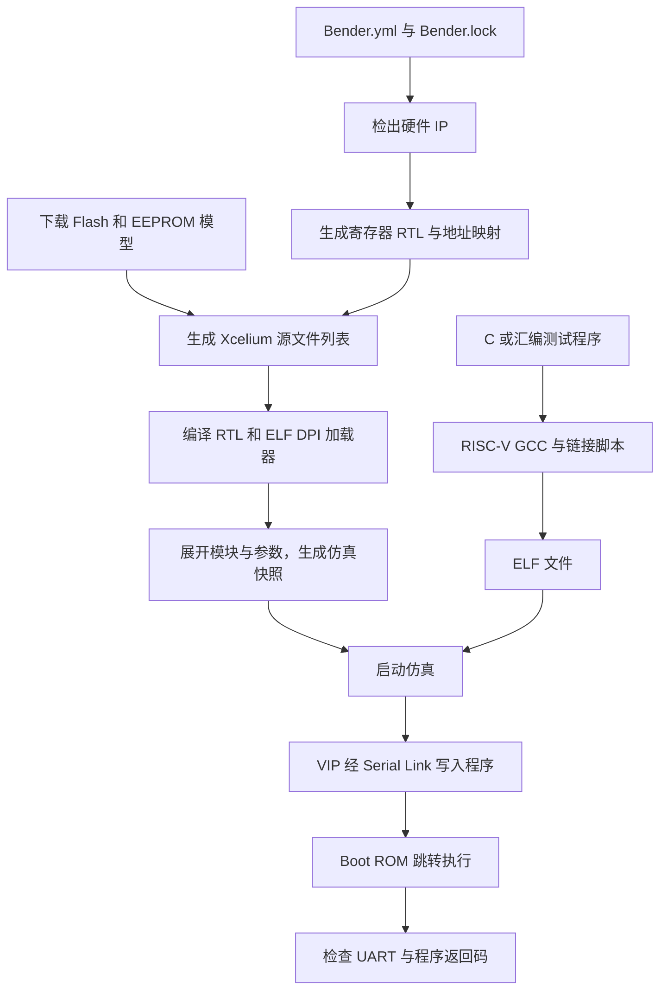

# 从模型缺失到六项测试通过：Cheshire 的 Xcelium 仿真搭建与调试实录

本文记录本次在 `/home/icer/try/cheshire` 工作目录中完成的修复、构建和验证过程。目标是让刚接触 RISC-V SoC 仿真的读者能够复现结果，并理解软件如何进入 RTL 中的处理器、错误为什么出现，以及每项测试究竟验证了什么。

验证日期：**2026 年 10 月 4 日，Asia/Shanghai**。项目仓库：[dv365lab/dv365-cheshire](https://github.com/dv365lab/dv365-cheshire)。

本文描述的是当前项目中的 Xcelium 修复和验证结果。`Makefile.xcelium`、`command.txt` 和 `vdebug_probe.tcl` 在本次处理前已经存在于工作目录；本次完善了前两个文件，保留了原有波形探测脚本。复现时应使用本文列出的全部文件和依赖配置。

## 1. 已经得到什么结果

原始问题是 Bender 找不到 SPI NOR Flash 的 Verilog 模型：

```text
error[E31]: File /home/icer/try/cheshire/target/sim/models/s25fs512s.v doesn't exist.
make: *** [Makefile.xcelium:96: .../cheshire_soc.f] Error 1
```

修复模型下载和构建依赖后，还解决了 Xcelium 的常量函数兼容问题、交叉编译器的 LTO 插件定位问题，以及 AXI 交叉开关连接矩阵在当前工具环境下被错误展开的问题。最终完成了六项真实 RTL 仿真，全部返回成功：

| 用例 | 主要验证内容 | 结果 |
| --- | --- | --- |
| `helloworld.spm.elf` | 从 SPM 执行、时钟频率测量、UART 输出 | PASS |
| `dma_1d.spm.elf` | DMA 一维数据搬运及结果比较 | PASS |
| `dma_2d.spm.elf` | DMA 重复搬运、源/目标步长及结果比较 | PASS |
| `dma_slink.spm.elf` | CPU 写入远端模型，DMA 经 Serial Link 读回 | PASS |
| `spm_uncached.spm.elf` | DMA 修改代码后，通过非缓存 SPM 地址执行新代码 | PASS |
| `helloworld.dram.elf` | 从外部 AXI 内存模型执行，并输出 UART 文本 | PASS |

六项测试使用同一个默认 SoC 配置，均采用 `BOOTMODE=0`、`PRELMODE=1`、`SEED=1`。整个回归命令的进程退出码为 **0**。

当前目录已经准备完成，直接运行 Hello World 的命令是：

```bash
cd /home/icer/try/cheshire
make -f Makefile.xcelium xrun-run BINARY=sw/tests/helloworld.spm.elf
```

首次搭建环境时，需要先完成第 5 节的依赖、硬件生成和软件构建步骤。

## 2. 先认识整个系统

### 2.1 这次仿真中的几个角色

Cheshire 是一个包含 CVA6 RISC-V 处理器的 SoC。处理器、DMA、Serial Link 等模块通过 AXI 总线访问内存和外设。理解下列名词，就能读懂后续流程：

| 名称 | 含义 | 本次的作用 |
| --- | --- | --- |
| RTL | 描述硬件行为的 SystemVerilog 等代码 | 描述 CPU、总线、DMA、UART 等电路 |
| DUT | Device Under Test，被测设计 | `cheshire_soc` |
| Testbench | 驱动和观察 DUT 的仿真代码 | 提供时钟、复位、程序加载和结束判断 |
| VIP | Verification IP，验证环境中的协议驱动器/模型 | 通过 Serial Link 发送访问请求，观察 UART |
| SPM | Scratchpad Memory，软件显式使用的片上存储区 | 默认测试的程序存储位置 |
| LLC | Last-Level Cache，末级缓存模块 | 启动阶段将相关存储配置为 SPM，并连接外部内存 |
| ELF | 包含机器代码、地址和入口信息的可执行文件格式 | 仿真加载器据此把程序写入内存 |
| DPI-C | SystemVerilog 与主机 C/C++ 代码之间的调用接口 | 用 C++ 解析 ELF，将字节交给 SV 驱动器 |
| MMIO | Memory-Mapped I/O，内存映射寄存器访问 | 软件通过读写地址配置 DMA、UART 和启动寄存器 |

本次运行的是裸机程序，没有启动 Linux。主机上的 RISC-V GCC 负责生成 RISC-V 指令；执行这些指令的是仿真中的 CVA6。

### 2.2 Testbench 的组织

主要层次关系是：

```text
tb_cheshire_soc
└── fix：fixture_cheshire_soc
    ├── dut：cheshire_soc
    │   ├── CVA6
    │   ├── AXI crossbar
    │   ├── LLC / SPM
    │   ├── DMA
    │   └── UART、Serial Link 等外设
    └── vip：vip_cheshire_soc
        ├── 时钟与复位
        ├── Serial Link / JTAG / UART 驱动
        ├── 外部 AXI 内存模型
        ├── SPI Flash、I²C EEPROM 模型
        └── ELF 加载与运行结果检查
```

可以依次阅读 [顶层 testbench](https://github.com/dv365lab/dv365-cheshire/blob/main/target/sim/src/tb_cheshire_soc.sv)、[fixture](https://github.com/dv365lab/dv365-cheshire/blob/main/target/sim/src/fixture_cheshire_soc.sv)、[VIP](https://github.com/dv365lab/dv365-cheshire/blob/main/target/sim/src/vip_cheshire_soc.sv) 和 [SoC RTL](https://github.com/dv365lab/dv365-cheshire/blob/main/hw/cheshire_soc.sv)。顶层决定启动方式，fixture 选择硬件配置并连接 DUT/VIP，VIP 实施协议操作。

### 2.3 两条构建路径最终会合



“软件编译成功”和“硬件编译成功”分别验证两条路径。只有程序成功加载、CPU 执行并返回正确结果，才完成整个验证闭环。

## 3. 原始报错为什么发生

### 3.1 IP 检出完成，不代表所有仿真文件已经齐全

[Bender.yml](https://github.com/dv365lab/dv365-cheshire/blob/main/Bender.yml) 和 [Bender.lock](https://github.com/dv365lab/dv365-cheshire/blob/main/Bender.lock) 管理硬件 IP 的来源和版本。Bender 的依赖检出与脚本生成流程可参考其[官方 README](https://github.com/pulp-platform/bender/blob/master/README.md)。

本项目还有两类独立的依赖：Git 子模块 `sw/deps/printf`，以及从模型提供方下载的 Flash/EEPROM Verilog 文件。终端显示 CVA6 子模块检出成功，只说明这一部分完成了。

`Bender.yml` 中的仿真目标包含：

```yaml
- target: any(simulation, test)
  files:
    - target/sim/models/s25fs512s.v
    - target/sim/models/24FC1025.v
    - target/sim/src/vip_cheshire_soc.sv
    - target/sim/src/tb_cheshire_pkg.sv
    - target/sim/src/fixture_cheshire_soc.sv
    - target/sim/src/tb_cheshire_soc.sv
```

Bender 生成文件列表时会检查这些路径。原来的独立 Xcelium 流程没有先建立模型下载依赖，因此在调用 Bender 时就失败了；当时尚未进入 Xcelium 的 RTL 编译。

### 3.2 为什么 Hello World 也需要 Flash 模型

程序虽然经 Serial Link 加载到 SPM，VIP 仍然实例化了 Flash 和 EEPROM。编译/展开需要知道这些模块的定义，实际运行时是否从它们启动是另一件事。

因此，创建空文件或从列表中直接删除模型，都不能完整修复问题。空文件不能提供模型模块；删除文件后，对应实例仍然缺少定义。

### 3.3 为什么后面的 `grep` 无法绕过缺失文件

曾有文件列表过滤步骤用于重排 testbench 文件，但 Bender 在输出之前已经检查模型存在性。因此：

```text
Bender 检查输入文件 → 发现文件缺失 → 退出
```

下游过滤器根本来不及“删掉那个路径”。应修复的是构建顺序：**先准备模型，再生成文件列表**。

## 4. 每项修改及其工作原理

### 4.1 将模型下载规则提取为共享文件

新增 [target/sim/models.mk](https://github.com/dv365lab/dv365-cheshire/blob/main/target/sim/models.mk)，并让 [cheshire.mk](https://github.com/dv365lab/dv365-cheshire/blob/main/cheshire.mk) 和 [Makefile.xcelium](https://github.com/dv365lab/dv365-cheshire/blob/main/Makefile.xcelium) 都包含它。这样，标准构建和独立 Xcelium 构建使用相同的模型获取规则。

共享文件用 `ifndef CHS_SIM_MODELS_INCLUDED` 防止重复包含。`CHS_SIM_MODELS_ALL` 保存两个模型目标的路径，供不同仿真流程声明依赖。

Flash 下载规则的关键部分是：

```make
$(CHS_ROOT)/target/sim/models/s25fs512s.v: $(CHS_ROOT)/Bender.yml | $(CHS_ROOT)/target/sim/models
	set -e; \
	  trap 'rm -f "$@.tmp"' EXIT; \
	  wget --no-check-certificate --timeout=30 --tries=2 \
	    https://freemodelfoundry.com/fmf_vlog_models/flash/s25fs512s.v -O "$@.tmp"; \
	  test -s "$@.tmp"; \
	  touch "$@.tmp"; \
	  mv "$@.tmp" "$@"
```

逐项解释：

| 写法 | 作用 |
| --- | --- |
| `$@` | GNU Make 当前要生成的目标文件 |
| `Bender.yml` 前置依赖 | 清单更新后允许重新获取模型 |
| `\|` 后面的目录 | 顺序依赖：先创建目录；目录时间变化不会单独触发重新下载 |
| `set -e` | 下载或检查失败时立即结束当前 shell 配方 |
| `.tmp` | 下载时使用临时文件，正式文件只在成功后替换 |
| `trap ... EXIT` | shell 结束时清理临时文件 |
| `--timeout=30 --tries=2` | 限制网络请求等待和重试次数 |
| `test -s` | 检查下载结果非空；并不等价于完整的内容校验 |
| `touch` | 更新本地时间，防止服务器保留的旧时间戳导致每次 Make 都重新下载 |
| `mv` | 在同一目录中把准备好的临时文件替换为正式目标 |

本机对 Free Model Foundry 的证书验证失败，因此这个地址保留了仓库原有的 `--no-check-certificate` 用法。它会跳过证书验证；若环境能正常验证该站点证书，应移除此参数。Microchip 下载没有使用该参数。模型的许可说明沿用项目[入门文档](../gs.md)中的约定。

EEPROM 从 ZIP 包中提取：

```make
wget --timeout=30 --tries=2 \
  https://ww1.microchip.com/downloads/en/DeviceDoc/24xx1025_Verilog_Model.zip \
  -O "$@.zip.tmp"
unzip -p "$@.zip.tmp" 24FC1025.v > "$@.tmp"
test -s "$@.tmp"
mv "$@.tmp" "$@"
```

原规则使用的是小写 `wget -o`，它指定的是 **wget 日志文件**；下载内容应使用大写 `-O` 指定。新规则明确保存 ZIP 的位置，再用 `unzip -p` 将指定成员输出到模型文件。

本次取得的模型信息如下。散列记录当前内容，便于判断将来同一 URL 下载到的文件是否变化：

| 文件 | 大小 | SHA-256 |
| --- | ---: | --- |
| `s25fs512s.v` | 380262 字节 | `067dbb37a2b44816441af6da698b96ab8587ee5a645800604702f731ea9172ea` |
| `24FC1025.v` | 33296 字节 | `a81600ee6afb2ee9c4e0d67b6ab640136c7cef5f250d911d5f3bacaca80c009e` |

模型模块分别为 `s25fs512s` 和 `M24FC1025`；文件名与模块名不要求完全一致。

### 4.2 修正 Xcelium 的文件列表和依赖关系

文件列表 `target/sim/xrun/cheshire_soc.f` 现在依赖两个模型、Bender 清单、锁文件、`Makefile.xcelium` 和共享下载规则。Make 会在生成 `.f` 之前先完成这些前置目标。

当前 Bender 目标参数为：

```text
-t sim -t rtl -t cva6 -t cv64a6_imafdchsclic_sv39 -t simulation
```

这些目标控制哪些源文件组被选中。CVA6 配置名采用当前依赖中实际存在的名称；选中一个名字不同的目标，并不能自动等价地得到相同 CPU 配置。

本次 SoC 编译没有启用整个依赖树的 `test` 目标，因为那会引入不属于当前 SoC 顶层的 IP 自测环境。VIP 所需的少量辅助文件被单独补入，例如 `axi_test.sv`、JTAG 接口和测试包。

生成流程先执行 Bender，再过滤和重排：

```make
$(BENDER) script flist-plus $(CHS_SIM_TARGETS) > $@.bender.tmp
grep -vE 'target/sim/(src|models)/' $@.bender.tmp > $@.tmp
# 在 .tmp 末尾追加辅助文件、模型和顶层文件
# 再过滤 trace_item.svh 独立编译条目，最后替换正式 .f
```

把 Bender 单独放在一个 Make 配方步骤中，可直接传播它的失败。若写成 `bender ... | grep ...`，普通 shell 默认返回管道最后一个命令的状态，有可能掩盖前面的失败。

本地 testbench 的顺序明确为：

```text
外部模型
tb_cheshire_pkg.sv
vip_cheshire_soc.sv
fixture_cheshire_soc.sv
tb_cheshire_soc.sv
```

先编译 package，再编译使用它的模块。CVA6 的 `instr_trace_item.svh`、`ex_trace_item.svh` 是头文件，当前流程过滤它们作为独立源文件的条目，仍然允许相关源代码通过包含路径引用它们。

当前列表仍可能重复出现 `axi_test.sv`，因此保留了既有 `-ALLOWREDEFINITION` 选项。这里的目标是得到已验证的 SoC 编译集合；该选项不应被当作任意重复定义都合理的证明。

### 4.3 让地址规则结构体能被 Xcelium 的常量函数计算

模型齐全后，编译出现了 `SVNSTP`：

```text
A bit/part select of a variable with a type parameter datatype
when used in a constant function is not currently supported.
```

在 [cheshire_soc.sv](https://github.com/dv365lab/dv365-cheshire/blob/main/hw/cheshire_soc.sv) 中，`gen_axi_map()` 和 `gen_reg_map()` 根据配置生成常量地址表。这些表决定一个 AXI 地址应路由到哪个输出端口。

原结构体的地址字段使用 `addr_t` 类型别名。在当前 Xcelium 环境中，常量函数与参数化类型组合触发了上述不支持的处理路径。修改为显式位宽：

```systemverilog
typedef struct packed {
  logic [$bits(aw_bt)-1:0] idx;
  logic [Cfg.AddrWidth-1:0] start_addr;
  logic [Cfg.AddrWidth-1:0] end_addr;
} addr_rule_t;
```

`addr_t` 对应的地址宽度原本也是 `Cfg.AddrWidth`，因此这里保留了字段宽度、打包布局和地址含义，只改变类型的表达方式。没有修改地址映射数值。

这一步解决的是编译/展开阶段的问题，还不足以说明总线在运行时已经连通。

### 4.4 定位并修复 AXI 连接矩阵

随后仿真能启动，但停留在：

```text
[SLINK] Wait for LLC configuration
```

VIP 此时通过 Serial Link 读取 `0x03001000`，等待 Boot ROM 配置 LLC/SPM。正常情况下，CPU 完成初始化后，这个轮询就应继续。

调试中增加了临时探测代码，观察 Serial Link 请求、DUT 地址译码、AXI 返回和连接参数。修复前的关键记录是：

```text
[PROBE] Connectivity 000000000000000000000000001111
[PROBE] VIP AR 000003001000
[PROBE] DUT AR 000003001000 decode 1 error 0
[PROBE] DUT R resp 3 data ca11ab1ebadcab1e
[PROBE] VIP R resp 3 data ca11ab1ebadcab1e
```

这里有三条相互支持的证据：

1. 请求地址确实是 LLC 配置寄存器，地址译码本身没有报错。
2. 返回的 `resp=3` 对应 AXI `DECERR`，并且数据是错误响应模块使用的固定值 `CA11AB1EBADCAB1E`。
3. 原本期望全连接的矩阵，在当前工具展开结果中只有低四位是 1。

AXI crossbar 的代码会检查 `Connectivity[i][j]`：为 1 时建立连接，为 0 时接入错误响应模块。因此，即使地址能匹配某个外设，连接矩阵禁用了这条路径，也会返回错误。

原参数写法为：

```systemverilog
.Connectivity ( '1 )
```

`'1` 的意图是在目标宽度上填满 1。但在此次 Xcelium 版本和参数传递层次下，实测结果没有得到完整的全 1 矩阵。修复为：

```systemverilog
.Connectivity ( {AxiIn.num_in * AxiOut.num_out{1'b1}} )
```

连接矩阵共有“输入端口数 × 输出端口数”个元素。复制运算明确产生这个数量的 1，避免依赖当前工具对无显式尺寸填充值的传播结果。这个写法保留了设计原有的全连接意图。

修复后，LLC 轮询、ELF 写入、入口设置、CPU 执行和结束码读取均成功。后续 DMA 和 Serial Link 测试也通过，进一步验证了不同总线主设备的访问路径。

此前还尝试过调整仿真时钟以及 JTAG 路径，用于区分驱动时序与路由问题；这些尝试没有解决根因，最终没有保留时钟修改。临时探测代码和日志放在被忽略的 `target/sim/xrun/` 下，正式运行顶层仍然只有 `tb_cheshire_soc`。

### 4.5 修正交叉编译器 LTO 插件的查找方式

软件构建使用 `-flto`。LTO 即链接时优化：编译器保留中间表示，使链接阶段能够跨源文件优化代码；带 LTO 信息的静态库处理也涉及工具插件。参见 [GCC LTO 说明](https://gcc.gnu.org/onlinedocs/gccint/LTO-Overview.html)。

原来的 [sw/sw.mk](https://github.com/dv365lab/dv365-cheshire/blob/main/sw/sw.mk) 假设插件位于某个固定的 `riscv64-unknown-elf` 目录结构。本机实际安装的是 xPack 的 `riscv-none-elf` 工具链，通过符号链接提供项目要求的命令名。这种情况下，“命令叫什么”和“实际安装目录叫什么”并不相同。

新规则向当前编译器询问路径：

```make
CHS_SW_LTOPLUG ?= $(shell $(CHS_SW_CC) -print-prog-name=liblto_plugin.so)
```

本机返回：

```text
/home/icer/eda/xpack-riscv-none-elf-gcc-15.2.0-1/bin/../libexec/gcc/riscv-none-elf/15.2.0/liblto_plugin.so
```

`?=` 还允许使用者显式覆盖 `CHS_SW_LTOPLUG`。`-print-prog-name` 与 `-print-file-name` 的搜索用途不同，见 [GCC 对这两个选项的说明](https://gcc.gnu.org/onlinedocs/gcc-15.2.0/gcc/Developer-Options.html)。在本机，用 `-print-file-name=liblto_plugin.so` 只得到文件名，而 `-print-prog-name` 得到了实际路径，因此选用了经验证的后者。

### 4.6 补齐 Python 生成工具环境

本机默认 Python 是旧版本，不能满足 [pyproject.toml](https://github.com/dv365lab/dv365-cheshire/blob/main/pyproject.toml) 中的 `Python >= 3.11` 要求，也缺少 `hjson`、`mako` 等生成工具依赖。

本次建立了 Python 3.11 虚拟环境，并安装项目声明的依赖。PeakRDL、寄存器生成工具以及模板脚本负责把 SystemRDL/HJSON 等描述转换为 RTL、软件寄存器头文件和链接地址定义。

因此，硬件生成与软件构建必须使用一致的配置。比如 Serial Link lane 数和 CLINT core 数会影响生成文件，不能只把一个旧头文件复制过来就假定寄存器地址一致。

调试中一次生成失败曾使重定向输出的寄存器头文件变为空；修正工具环境后恢复了该文件，并完成生成。某些生成器版本还产生了仅涉及注释或格式的差异，最终恢复了这些无关改动，保留必要的功能修复。

### 4.7 加入批处理运行脚本和输入检查

新增 [run.xcelium.tcl](https://github.com/dv365lab/dv365-cheshire/blob/main/target/sim/src/run.xcelium.tcl)：

```tcl
# Run the loaded simulation to completion in batch mode.
run
exit
```

`run` 让仿真继续到 testbench 结束，`exit` 退出工具。`xrun-run` 先调用编译/展开目标，再通过 `xrun -R` 运行快照，默认加载这个 Tcl 脚本。

另外做了三项处理：把 `BINARY`、`IMAGE` 转换为绝对路径，避免工作目录切换后找不到文件；检查输入是否存在且可读；根据测试名保存日志并检查成功标记。

原来的 [vdebug_probe.tcl](https://github.com/dv365lab/dv365-cheshire/blob/main/vdebug_probe.tcl) 保留为可选输入，不再作为每次批处理的默认脚本。波形数据库会增加运行开销和磁盘占用，日常先用日志确认功能，再按需采集波形。

### 4.8 调整命令示例和忽略规则

[command.txt](https://github.com/dv365lab/dv365-cheshire/blob/main/command.txt) 现在保存已经验证通过的 `.spm.elf` 运行命令。

[.gitignore](https://github.com/dv365lab/dv365-cheshire/blob/main/.gitignore) 增加 `.venv/`、`*.egg-info/` 和 `target/sim/xrun/`，让 Python 环境、仿真快照、运行日志和波形留在本地，不混入源代码改动。

## 5. 从环境准备开始复现

### 5.1 本次实际工具版本

| 工具 | 本次版本/用途 |
| --- | --- |
| GNU Make | 4.2.1，调度构建依赖 |
| Bender | 0.32.1，硬件 IP 依赖及文件列表 |
| Python | 3.11.16，项目生成工具环境 |
| PeakRDL | 1.5.0，SystemRDL 处理 |
| RISC-V GCC | xPack 15.2.0，生成裸机程序 |
| 主机 G++ | 8.5.0，编译 ELF DPI-C 加载器 |
| Cadence Xcelium | `26.03-a071`，编译、展开和运行 RTL |

还需要 Git、wget、unzip、主机 `readelf`，以及已配置好许可证的 Xcelium 安装。以上版本是本次成功组合，不表示其他版本都不兼容。

所有下面的 `make` 命令均从 Cheshire 仓库根目录执行。

```bash
cd /home/icer/try/cheshire
git remote -v
command -v bender xrun g++ python3.11
command -v riscv64-unknown-elf-gcc riscv64-unknown-elf-ar
bender --version
xrun -version
riscv64-unknown-elf-gcc --version
```

### 5.2 工具链路径与命令前缀

若 PATH 中已有项目要求的 `riscv64-unknown-elf-*` 命令，直接使用即可。也可以在软件构建命令中传入：

```bash
make -j4 "$PWD/sw/tests/helloworld.spm.elf" \
  CHS_SW_GCC_BINROOT=/path/to/riscv64-unknown-elf-toolchain/bin
```

该变量选择目录，不会自动把命令前缀改成 `riscv-none-elf`。

本机已经存在符号链接，把 `riscv64-unknown-elf-gcc/ar/objcopy/objdump` 指向 xPack 对应工具。如果使用同类安装，可以在仓库内建立独立别名目录，无需改动实际工具链：

```bash
# 把这个路径改为实际安装路径；已有标准命令时跳过本段。
chs_riscv_bin=/path/to/xpack-riscv-none-elf-gcc/bin
mkdir -p .tools/riscv-bin
for tool in gcc ar objcopy objdump; do
  ln -s "$chs_riscv_bin/riscv-none-elf-$tool" \
    ".tools/riscv-bin/riscv64-unknown-elf-$tool"
done
export PATH="$PWD/.tools/riscv-bin:$PATH"
```

这里使用新目录中的符号链接；若目标已存在，先确认其用途再处理。别名目录是本地环境文件，不需要作为功能源码提交。

检查插件是否确实存在：

```bash
chs_lto_plugin=$(riscv64-unknown-elf-gcc -print-prog-name=liblto_plugin.so)
printf '%s\n' "$chs_lto_plugin"
test -f "$chs_lto_plugin"
```

### 5.3 创建 Python 环境并准备依赖

以下是首次安装命令；当前目录已有 `.venv` 时只需要激活它：

```bash
python3.11 -m venv .venv
source .venv/bin/activate
python -m pip install .
```

本次使用的是安装 `pyproject.toml` 声明依赖的 pip 路径，具体包版本受到当时解析结果影响。需要使用仓库锁文件的环境也可按[入门文档](../gs.md)采用 `uv sync`，但本文的实测结果来自上述 pip 安装。

硬件 IP 使用锁文件检出，软件 printf 使用 Git 子模块：

```bash
bender checkout
git submodule update --init --recursive sw/deps/printf
```

不要为了修复缺失模型直接运行 `bender update`；它会重新解析依赖版本，而当前问题是模型准备顺序。根构建也会通过 `.bender/.chs_deps` 规则自动检查必要依赖。

### 5.4 生成硬件，构建所需软件

```bash
source .venv/bin/activate
make -j4 hw-all
make -j4 \
  "$PWD/sw/tests/helloworld.spm.elf" \
  "$PWD/sw/tests/dma_1d.spm.elf" \
  "$PWD/sw/tests/dma_2d.spm.elf" \
  "$PWD/sw/tests/dma_slink.spm.elf" \
  "$PWD/sw/tests/spm_uncached.spm.elf" \
  "$PWD/sw/tests/helloworld.dram.elf"
```

使用 `"$PWD/..."` 是因为项目中部分目标以绝对路径声明，这样能明确命中目标。

`hw-all` 配置并生成相关 IP、寄存器 RTL 和地址映射。本次使用仓库已有的 Boot ROM RTL，没有重建 Boot ROM；重建它是单独的 `bootrom-all` 目标，需要考虑项目对可重复构建的工具链要求。

本次按需构建六个 ELF，没有执行整个 `sw-all`。完整软件构建还涉及其他测试、设备树和镜像工具，不能把这些额外依赖误当作运行一个 SPM 测试的必要条件。

### 5.5 生成列表、编译和运行

可以分阶段检查：

```bash
# 自动下载缺失模型并生成文件列表。
make -f Makefile.xcelium xrun-flist

# 编译和展开，产生可运行快照。
make -f Makefile.xcelium xrun-compile

# 加载软件并执行；这个目标也会先检查编译步骤。
make -f Makefile.xcelium xrun-run \
  BINARY=sw/tests/helloworld.spm.elf BOOTMODE=0 PRELMODE=1
```

当前 Makefile 的编译目标是 phony，每次会调用 Xcelium；工具再根据已有工作库判断是否需要重编。修改软件 ELF 后，运行流程会重新读取 ELF，无需手工把它转换为另一种文件格式。

首次硬件编译需要处理大量 IP；后续同一配置的测试可复用已有工作库。不要让多个进程同时使用同一个 `XRUN_WORK` 运行仿真；本文使用顺序回归。

## 6. 软件从 C 源码到 CPU 执行的全过程

### 6.1 交叉编译和链接分别做什么

[sw/sw.mk](https://github.com/dv365lab/dv365-cheshire/blob/main/sw/sw.mk) 将 C/汇编编译为目标文件，构建 `libcheshire.a`，最后用链接脚本生成 ELF。

主要编译选项包括：

| 选项 | 含义 |
| --- | --- |
| `-march=rv64gc_zifencei` | 选择 64 位 RISC-V 指令集及相应扩展 |
| `-mabi=lp64d` | 选择与双精度浮点寄存器传参相匹配的 ABI |
| `-O2`、`-flto` | 常规优化与链接时优化 |
| `-mcmodel=medany` | 采用项目需要的地址生成代码模型 |
| `-nostartfiles` | 使用项目自己的启动代码，而非工具链默认启动文件 |
| `-ffunction-sections`、`-fdata-sections`、`--gc-sections` | 分离并移除未使用的代码/数据节 |
| `-ggdb` | 保留调试信息；调试信息并不都写入 DUT 内存 |

链接脚本除了排列代码，还指定代码应在哪里运行、加载到哪里，以及入口 `_start`。

### 6.2 为什么本次必须选择 `.spm.elf`

三个 Hello World ELF 使用同一个 C 程序，但链接位置不同：

| 文件 | 运行地址 VMA | 加载地址 LMA / ELF `PhysAddr` | 入口 |
| --- | --- | --- | --- |
| `helloworld.spm.elf` | `0x10000000` | `0x10000000` | `0x10000000` |
| `helloworld.rom.elf` | `0x10000000` | `0x00000000` | `0x10000000` |
| `helloworld.dram.elf` | `0x80000000` | `0x80000000` | `0x80000000` |

这里的数值来自本次实际 `readelf -l` 检查。

[rom.ld](https://github.com/dv365lab/dv365-cheshire/blob/main/sw/link/rom.ld) 使用 `> spm AT>extrom`：代码最终在 SPM 中执行，但初始镜像放在外部 ROM 地址空间，供相应启动流程搬入 SPM。

本次被动启动则由 VIP 直接装载 ELF。[elfloader.cpp](https://github.com/dv365lab/dv365-cheshire/blob/main/target/sim/src/elfloader.cpp) 遍历 `PT_LOAD` program header，使用 `p_paddr` 作为写入地址，使用 `e_entry` 作为入口。因此，直接把 `.rom.elf` 传给同一条 SPM 预加载命令，会让代码写入 `0x00000000`，随后却跳到 `0x10000000`，不符合这条启动路径的需求。

自己检查的方法：

```bash
readelf -h sw/tests/helloworld.spm.elf
readelf -l sw/tests/helloworld.spm.elf

# 如需对照 ROM 版本，先构建再检查。
make "$PWD/sw/tests/helloworld.rom.elf"
readelf -l sw/tests/helloworld.rom.elf
```

SPM 版本的 `LOAD` 项应显示 `VirtAddr`、`PhysAddr` 都是 `0x10000000`。本次 Hello World 可加载内容为 767 字节；ELF 文件更大，因为还包含符号表、字符串表和调试信息。

### 6.3 DPI-C 负责解析，Serial Link 负责真正写入

VIP 通过 DPI-C 调用 `read_elf`、`get_section`、`read_section` 和 `get_entry`。C++ 加载器解析 ELF 并把程序内容提供给 SV；它本身并不让主机直接执行 RISC-V 程序。

`slink_elf_preload()` 随后把每个可加载区域拆成 burst：默认最多 1024 字节，并且不跨越 4 KiB 边界。原因是 AXI burst 有协议边界要求，较大程序必须拆分为多个访问。

当前默认 AXI 数据宽度为 64 位，一拍对应 8 字节。VIP 将字节组装为数据拍，再通过 Serial Link 的协议转换送到 DUT 的 AXI 入口。非对齐的起始地址由代码计算总线内偏移并组织首拍。

当前加载器按数据拍写入，本文没有把六个用例的成功解释为对所有非对齐地址、末拍填充和自定义 ELF 布局的全面验证。扩展特殊布局时，应检查实际 burst 和周边数据。

### 6.4 Boot ROM 和 VIP 如何交接

`BOOTMODE=0` 表示被动启动。CPU 先执行 [Boot ROM](https://github.com/dv365lab/dv365-cheshire/blob/main/hw/bootrom/cheshire_bootrom.c)，初始化必要硬件，随后等待外部加载器提供入口和启动信号。

Serial Link 启动任务按以下顺序工作：

1. 轮询 LLC 配置，等待 SPM 可用。
2. 解析 ELF，通过 Serial Link 将代码和数据写入指定地址。
3. 将入口高 32 位写入 `scratch[1]`，低 32 位写入 `scratch[0]`。
4. 向 `scratch[2]` 写入 `2`，即设置 bit 1。
5. Boot ROM 发现 `scratch[2] & 2` 非零，清零该寄存器，然后跳到入口。

注意 bit 编号从 0 开始，所以十进制 2 对应 **bit 1**。Boot ROM 源码附近有旧注释把它描述为 bit 2，理解当前协议应以实际表达式和 VIP 写入值为准。

常用地址如下：

| 区域 | 地址 | 用途 |
| --- | --- | --- |
| DMA | `0x01000000` | 配置搬运任务 |
| Boot ROM | `0x02000000` | CPU 上电后的引导程序 |
| SoC 寄存器 | `0x03000000` | 包含 `scratch[]` 等寄存器 |
| LLC 寄存器 | `0x03001000` | SPM/缓存配置 |
| UART | `0x03002000` | 字符输出 |
| SPM | `0x10000000` | 默认程序存储区 |
| 非缓存 SPM 别名 | `0x14000000` | 绕过 CPU 缓存属性访问同一片上存储 |
| 外部内存 | `0x80000000` | DRAM 链接版本的程序位置 |

这些定义可在 [cheshire_addrmap_pkg.sv](https://github.com/dv365lab/dv365-cheshire/blob/main/hw/cheshire_addrmap_pkg.sv) 和 [cheshire_addrs.ldh](https://github.com/dv365lab/dv365-cheshire/blob/main/sw/link/cheshire_addrs.ldh) 中对照。非缓存别名相对普通 SPM 增加 `0x04000000`；它并不代表新增了一块同样大小的物理 RAM。

### 6.5 `_start` 为什么不能省略

入口首先执行 [crt0.S](https://github.com/dv365lab/dv365-cheshire/blob/main/sw/lib/crt0.S) 中的 `_start`，而不是直接调用 `main()`。CRT0 负责设置执行环境，包括中断状态、栈/全局指针、异常向量、`.bss` 清零和浮点寄存器初始化。

SPM 链接的默认栈符号为 0，CRT0 因而保留 Boot ROM 提供的栈上下文；DRAM 链接脚本另行设置外部内存中的栈位置。

`.bss` 表示初始应为零的变量，通常无需在 ELF 文件里保存大量零字节。当前 ELF 加载器也会提示某些零初始化区域没有预加载，清零职责由 CRT0 完成。

### 6.6 程序返回值如何变成 PASS

`main()` 返回后，CRT0 将结果编码到 `scratch[2]`：

```text
scratch[2] = (返回值 << 1) | 1
```

bit 0 表示执行结束，其余位保存返回值。VIP 轮询 bit 0，读取后右移一位：返回值为 0 时输出 `[SLINK] SUCCESS`，否则报告失败。

这与前面的启动信号不同：**启动使用 bit 1；结束使用 bit 0 加返回码**。Boot ROM 在跳转前清零寄存器，避免把启动信号误认成最终返回码。

顶层等 UART 当前字节接收完成后调用 `$finish`。日志中的 `$finish(1)` 是仿真结束信息，并不表示 shell 进程退出码为 1。判断本次结果应同时看：程序返回码对应的成功标记、Xcelium 是否正常退出，以及 Make 命令的退出码。

## 7. Hello World 为什么可以验证完整链路

[helloworld.c](https://github.com/dv365lab/dv365-cheshire/blob/main/sw/tests/helloworld.c) 首先读取 RTC 参考频率，用 CLINT 的 `mtime` 和 CPU 的 `mcycle` 测量核心时钟频率，再设置 UART 波特率、写出字符串并等待发送完成。

频率计算的基本关系是：

```text
核心频率 = 核心周期增量 × RTC 频率 / RTC 计数增量
```

这里 `clint_get_core_freq(rtc_freq, 2500)` 的第二个参数是测量时间窗口的倒数参数，不是“等待 2500 个周期”。以 32768 Hz 参考频率计算，代码中的 `num_ticks = 32768 / 2500` 为 13。

VIP 默认系统时钟周期是 5 ns，即名义 200 MHz；RTC 时钟周期是 30518 ns，约为 32768 Hz。UART 根据测得的频率配置 115200 波特率。日志里的 `[UART] Hello World!` 来自对 DUT 串口信号的接收，程序实际经过了 CPU 执行和 UART 硬件发送。

本次回归中的 Hello World 日志片段：

```text
[SLINK] Wait for LLC configuration
[SLINK] Preloading ELF binary: .../sw/tests/helloworld.spm.elf
[ELF] INFO: Entrypoint at 0x10000000
[SLINK] Preloading section at 0x0000000010000000 (767 bytes)
[SLINK] Preload complete
[SLINK] Wrote launch signal and entry point 0x0000000010000000
[UART] Hello World!
[SLINK] SUCCESS
Simulation complete via $finish(1) at time 2256055 NS + 2
PASS: helloworld.spm
```

加载日志检查地址与入口，UART 输出检查实际软件行为，结束码检查程序是否完成。三个层面的证据组合起来，比只看到仿真窗口打开更有意义。

## 8. 其他五项用例的原理与实测结果

### 8.1 DMA 一维搬运

[dma_1d.spm.c](https://github.com/dv365lab/dv365-cheshire/blob/main/sw/tests/dma_1d.spm.c) 首先检查硬件是否存在 DMA，然后准备源字符串、目标区和预期结果。源和目标通过加 `0x04000000` 访问非缓存 SPM 别名，避免把 CPU 缓存中的数据误当作 DMA 一定能读到的物理存储内容。

测试先将源内容写到非缓存地址，再调用 `sys_dma_blk_memcpy()`。这个接口写入源地址、目标地址、字节数和配置，取得传输 ID，再轮询完成 ID。CPU 配置和等待任务，实际数据搬运由 DMA 发出 AXI 访问完成。

目标尾部预先写入 `!` 和字符串终止符，搬运不应覆盖它们。最后逐字节比较整个预期字符串，不匹配的字节数作为 `main()` 返回值；因此返回 0 才是正确结果。

```bash
make -f Makefile.xcelium xrun-run BINARY=sw/tests/dma_1d.spm.elf
```

### 8.2 DMA 二维搬运

[dma_2d.spm.c](https://github.com/dv365lab/dv365-cheshire/blob/main/sw/tests/dma_2d.spm.c) 使用相同的非缓存访问和结果比较方法，但调用二维 DMA 接口。

根据 [dma.h](https://github.com/dv365lab/dv365-cheshire/blob/main/sw/include/dif/dma.h)，参数顺序是：

```c
sys_dma_2d_blk_memcpy(dst, src, size, dst_stride, src_stride, num_reps, conf);
```

这个用例实际设置：每轮 15 字节，目标步长 7 字节，源步长 1 字节，重复 4 次。也就是说，第 `k` 轮的源起点是 `src + k`，目标起点是 `dst + 7*k`。

由于目标步长小于每轮字节数，目标区域发生重叠，后续轮次覆盖前面部分内容。预期字符串正是根据这些重叠写入计算的。它验证了二维地址生成，不是简单地连续拷贝四份原字符串。

```bash
make -f Makefile.xcelium xrun-run BINARY=sw/tests/dma_2d.spm.elf
```

### 8.3 DMA 经 Serial Link 访问远端

[dma_slink.spm.c](https://github.com/dv365lab/dv365-cheshire/blob/main/sw/tests/dma_slink.spm.c) 检查 DMA 和 Serial Link 均存在。它将本地目标指针再加 `0x100000000`，形成测试使用的远端访问地址。

CPU 先经 Serial Link 将源字符串写入远端，再让 DMA 从远端读回本地非缓存 SPM，最后逐字节验证结果。这样覆盖了 CPU 发起的远端写、DMA 发起的远端读，以及本地目标写入路径。

当前 testbench 的远端由启用 `MAPPED=1`、`RAND_RESP=0` 的 AXI 从设备模型承接：它保存写入的数据并在读取时返回。本次并没有实例化另一套完整 Cheshire CPU，因此结果应表述为“远端协议与存储模型访问通过”。

```bash
make -f Makefile.xcelium xrun-run BINARY=sw/tests/dma_slink.spm.elf
```

### 8.4 非缓存 SPM 执行

[spm_uncached.spm.c](https://github.com/dv365lab/dv365-cheshire/blob/main/sw/tests/spm_uncached.spm.c) 验证的不只是普通数据访问，还包括指令获取：

1. 执行 `payload1()`，写出结果 1，使其指令可能进入缓存。
2. DMA 将 `payload2()` 的 64 字节代码覆盖到 `payload1()` 的物理位置。
3. 将原函数地址加上 `0x04000000`，从非缓存别名执行这个位置。
4. 新执行的代码写出结果 2，最终检查 `1 + 2 == 3`。

若第二次执行仍取得旧指令，就无法得到预期结果。此测试确认当前非缓存地址路径能够取到 DMA 修改后的代码；不能据此推导系统已验证所有缓存一致性场景。

```bash
make -f Makefile.xcelium xrun-run BINARY=sw/tests/spm_uncached.spm.elf
```

### 8.5 外部内存中的 Hello World

`helloworld.dram.elf` 使用 [dram.ld](https://github.com/dv365lab/dv365-cheshire/blob/main/sw/link/dram.ld)，将加载地址和入口设置为 `0x80000000`。Serial Link 写入经过 SoC 的外部内存路径，CPU 再从该地址执行程序。

本次 `UseDramSys=0`，外部内存由 VIP 中的 `axi_sim_mem` 提供。这能验证当前外部 AXI 内存路径的功能，不能用于声称已经验证真实 DDR4 的时序或性能。

```bash
make -f Makefile.xcelium xrun-run BINARY=sw/tests/helloworld.dram.elf
```

实测日志同时出现入口 `0x80000000`、该地址的程序预加载、UART Hello World 和 `[SLINK] SUCCESS`。

### 8.6 本次六项回归的详细记录

下面时间取自 2026-10-04 00:42—00:43 的真实日志。仿真时间是 DUT 世界中的时间；主机时间是工具运行所用的实际时间，两者不能直接等同。

| 用例 | 入口地址 | 结束仿真时间（ns，另有子时间步） | Xcelium 运行阶段主机时间 | 结果 |
| --- | --- | ---: | ---: | --- |
| `helloworld.spm` | `0x10000000` | 2256055 | 20 秒 | PASS |
| `dma_1d.spm` | `0x10000000` | 545020 | 5 秒 | PASS |
| `dma_2d.spm` | `0x10000000` | 564710 | 5 秒 | PASS |
| `dma_slink.spm` | `0x10000000` | 556215 | 4 秒 | PASS |
| `spm_uncached.spm` | `0x10000000` | 512845 | 5 秒 | PASS |
| `helloworld.dram` | `0x80000000` | 2255790 | 22 秒 | PASS |

这些主机时间不包含首次完整硬件编译，也不作为性能基准。机器负载、工具版本和波形设置都会影响耗时。

## 9. 一条命令复现六项回归

先按第 5 节构建六个 ELF，然后运行：

```bash
make -f Makefile.xcelium xrun-regress \
  REGRESS_ELFS="sw/tests/helloworld.spm.elf \
sw/tests/dma_1d.spm.elf \
sw/tests/dma_2d.spm.elf \
sw/tests/dma_slink.spm.elf \
sw/tests/spm_uncached.spm.elf \
sw/tests/helloworld.dram.elf"
```

`xrun-regress` 按顺序调用每个 ELF 的 `xrun-run`；某项失败会记录失败状态，继续后面的项目，最后返回非零。全部通过时应得到：

```text
PASS: helloworld.spm
PASS: dma_1d.spm
PASS: dma_2d.spm
PASS: dma_slink.spm
PASS: spm_uncached.spm
PASS: helloworld.dram
```

本次额外构建的输出保存在 `target/sim/xrun/work/logs/additional-software-build.log`，回归总输出保存在 `target/sim/xrun/work/logs/regression-default.log`。每项用例还有独立日志：

```text
target/sim/xrun/work/logs/helloworld.spm.log
target/sim/xrun/work/logs/dma_1d.spm.log
target/sim/xrun/work/logs/dma_2d.spm.log
target/sim/xrun/work/logs/dma_slink.spm.log
target/sim/xrun/work/logs/spm_uncached.spm.log
target/sim/xrun/work/logs/helloworld.dram.log
```

日志属于本地生成文件，清理或换机器后不会随 Git 自动出现；上面的表格和结果片段保留了本次验证记录。

默认 `REGRESS_ELFS` 会选择已经存在的全部 `*.spm.elf`。若目录中有需要 AXI-RT 或 CLIC 的程序，这些程序并不适合默认配置。因此复现本文时显式使用上述列表。

## 10. 参数、构建阶段和当前可用范围

### 10.1 区分编译、展开和运行

| 阶段 | 主要动作 | 常见错误 |
| --- | --- | --- |
| 依赖准备 | 检出 IP、生成寄存器、下载模型 | 文件缺失、网络失败、Python 包缺失 |
| 软件构建 | 交叉编译、归档、链接 | 工具路径错误、插件缺失、链接脚本不匹配 |
| RTL 编译 | 检查源文件、类型、package；编译 DPI C++ | 语法错误、类型不支持、文件顺序错误 |
| 展开 elaboration | 实例化模块、计算参数和常量、确定连接拓扑 | 参数值或层次连接错误 |
| 运行 simulation | 时钟推进、协议操作、CPU 执行 | 总线错误、加载地址错误、软件返回失败 |

当前 `xrun-compile` 使用 `-elaborate`，形成工作库和仿真快照；`xrun-run` 使用 `-R` 运行已有快照。

重要 Xcelium 选项包括 `-64bit`、`-sv`、`-top tb_cheshire_soc`、`-f` 文件列表和 `-xmlibdirname` 工作库位置。`-access +rwc`、`-lwdgen` 和 `-debug_opts verisium_pp` 为调试准备信息；`-svseed` 固定 SV 随机种子。Makefile 也保留了针对几类警告的抑制选项，遇到新问题时应查看完整日志，不应把“没有显示警告”当作行为正确的证据。

### 10.2 本次用到的运行参数

| 参数 | 本次值 | 作用 |
| --- | --- | --- |
| `BINARY` | 对应 `.spm.elf` 或 `.dram.elf` | 待加载的 ELF 路径 |
| `BOOTMODE` | 0 | Boot ROM 等待外部加载并启动 |
| `PRELMODE` | 1 | 使用 Serial Link 加载 |
| `SEED` | 1 | SV 随机种子 |
| `XRUN_RUN_INPUT` | `target/sim/src/run.xcelium.tcl` | 工具的运行脚本 |

`BINARY` 等运行值以 `+BINARY=...` 这类 plusarg 传给 SV，并由 `$value$plusargs` 读取。SV 宏与 module 参数则通常在编译/展开时决定；仅仅传入一个同名宏，不会自动覆盖 module 参数。

### 10.3 需要明确的现有限制

以下功能没有在本次六项回归中完成验证，部分接口还没有接好：

| 项目 | 当前状态与使用边界 |
| --- | --- |
| `SELCFG` | Makefile 传的是 `+define+SELCFG=...`，顶层实际使用 `SelectedCfg` 参数，源码没有用该宏覆盖参数。仅设置 `SELCFG=1/2/3` 不能证明切换了硬件配置。 |
| AXI-RT、CLIC、vCLIC 用例 | testbench 包定义了这些配置，但本次只验证默认配置，不声称这些专用测试已经通过。 |
| `TIMEOUT_NS` | Makefile 传入 plusarg，当前 testbench 没有读取它的 watchdog；它尚不是有效超时保护。 |
| JTAG、UART、MEMH 加载 | 源码分别提供 `PRELMODE=0/2/3`；本次最终回归使用 1，没有把其他加载方式记为成功。 |
| 自主外部启动 | `BOOTMODE=2/3` 涉及 Flash/EEPROM 镜像；未完成端到端验证。当前顶层对 `BOOTMODE=1` 的 SD Card 路径直接报不支持。 |
| DRAMSys | Makefile 的 SystemC/库路径仍有 TODO，且 `UseDramSys` 参数需正确连接；本次 DRAM 用例使用 `axi_sim_mem`。 |
| GUI | `xrun-gui` 引用了 `target/sim/xrun/waves.tcl`，当前没有该脚本，未验证这一目标。 |
| 覆盖率 | `xrun-cov`、`xrun-cov-report` 已有入口，但本次未验证编译/运行组合和 IMC 报告流程。 |
| Verisium 波形 | 原脚本保留，调试中曾生成数据库；未将修复后的完整波形运行计入本次成功记录。 |

若希望避免新用例无限等待，可以在主机层限制运行时间。例如 GNU `timeout` 可包装同一条仿真命令；这属于主机进程超时，不是仿真时间 watchdog：

```bash
timeout 300s make -f Makefile.xcelium xrun-run \
  BINARY=sw/tests/helloworld.spm.elf
```

已有波形脚本可按下面方式显式选择。该命令是后续调试入口，不能与本次已通过的批处理记录混为一项验证：

```bash
make -f Makefile.xcelium xrun-run \
  BINARY=sw/tests/helloworld.spm.elf \
  XRUN_RUN_INPUT=vdebug_probe.tcl
```

脚本的相对数据库路径会落在 `target/sim/xrun/work/` 中，因为工具在那里运行。

## 11. 遇到问题时按哪个顺序检查

| 现象 | 优先检查 | 原因与下一步 |
| --- | --- | --- |
| Bender E31，模型不存在 | `target/sim/models/`，共享规则是否已包含 | 运行 `xrun-flist`，先查看下载/解压错误 |
| 模型存在但为空 | `test -s`、下载来源、解压成员名 | 重新取得有效模型；不能用空文件满足依赖 |
| `hjson`、`mako` 缺失或 PeakRDL 不存在 | Python 版本与 `.venv` 是否激活 | 使用项目依赖环境，再重做失败的生成步骤 |
| LTO 插件找不到 | GCC 实际路径和 `-print-prog-name` 输出 | 检查文件存在，必要时覆盖 `CHS_SW_LTOPLUG` |
| `SVNSTP` | 地址结构体和常量函数 | 确认显式位宽修改已经包含在当前 RTL 中 |
| 停在等待 LLC 配置 | 请求地址、AXI 响应、连接矩阵、Boot ROM 活动 | 先定位请求在哪一层出错；不能仅从等待文本推断 CPU 停了 |
| `DECERR` 与 `CA11AB1EBADCAB1E` | crossbar 译码及被禁用连接 | 这是错误从设备的固定返回；检查地址与 `Connectivity` |
| ELF 已加载，程序无输出 | `readelf -l`、入口与加载地址 | 检查是否误用了 `.rom.elf`，再检查 CPU 执行/异常 |
| 用例报告硬件功能不存在 | 默认配置是否含所需 IP | AXI-RT/CLIC 用例需要真正切换参数并重新展开 |
| 没有 UART 文本，但有 SUCCESS | 用例本身是否打印 | DMA 等测试依靠数据比较和返回码，不要求打印字符串 |

查看本次相关日志的简单命令：

```bash
tail -n 60 target/sim/xrun/work/logs/helloworld.spm.log
rg -n 'ERROR|FAILED|SUCCESS|PASS:|Entrypoint' \
  target/sim/xrun/work/logs/regression-default.log
```

`xrun-clean` 会删除工作库和日志，需要重编，也会失去本地诊断记录。通常先保留日志、定位问题，再决定是否清理；缺一个模型并不需要删除整个依赖树。

## 12. 本次交付文件与阅读顺序

| 文件 | 本次处理 | 解决的问题 |
| --- | --- | --- |
| [target/sim/models.mk](https://github.com/dv365lab/dv365-cheshire/blob/main/target/sim/models.mk) | 新增 | 共享并可靠地下载模型 |
| [cheshire.mk](https://github.com/dv365lab/dv365-cheshire/blob/main/cheshire.mk) | 修改 | 标准流程复用共享模型规则 |
| [Makefile.xcelium](https://github.com/dv365lab/dv365-cheshire/blob/main/Makefile.xcelium) | 完善已有文件 | 下载依赖、文件列表、编译/运行、输入路径、日志和回归 |
| [hw/cheshire_soc.sv](https://github.com/dv365lab/dv365-cheshire/blob/main/hw/cheshire_soc.sv) | 修改两处 | 常量地址表兼容、AXI 全连接参数显式位宽 |
| [sw/sw.mk](https://github.com/dv365lab/dv365-cheshire/blob/main/sw/sw.mk) | 修改 | 通过实际编译器定位 LTO 插件 |
| [target/sim/src/run.xcelium.tcl](https://github.com/dv365lab/dv365-cheshire/blob/main/target/sim/src/run.xcelium.tcl) | 新增 | 默认批处理运行并退出 |
| [command.txt](https://github.com/dv365lab/dv365-cheshire/blob/main/command.txt) | 更新已有文件 | 提供已验证的 SPM Hello World 命令 |
| [.gitignore](https://github.com/dv365lab/dv365-cheshire/blob/main/.gitignore) | 修改 | 忽略本地 Python 环境和 Xcelium 输出 |
| [vdebug_probe.tcl](https://github.com/dv365lab/dv365-cheshire/blob/main/vdebug_probe.tcl) | 保留 | 继续提供可选 Verisium 探测脚本 |
| 本文 | 新增 | 保存复现步骤、原理、诊断证据和六项实测记录 |

新增回归没有修改这些测试程序的判断逻辑，也没有放宽它们的正确性条件；使用的是仓库已有程序及其返回码协议。

建议先按第 5 节跑通一个 Hello World，随后对照第 6 节读加载和启动源码，最后逐个运行第 8 节用例。这样每增加一项测试，都能把实际日志对应到软件地址、总线事务和硬件功能，而不是仅仅记住一条命令。
